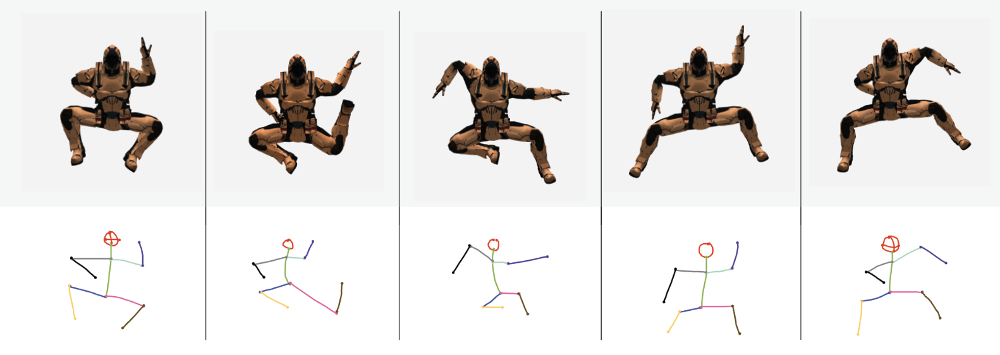
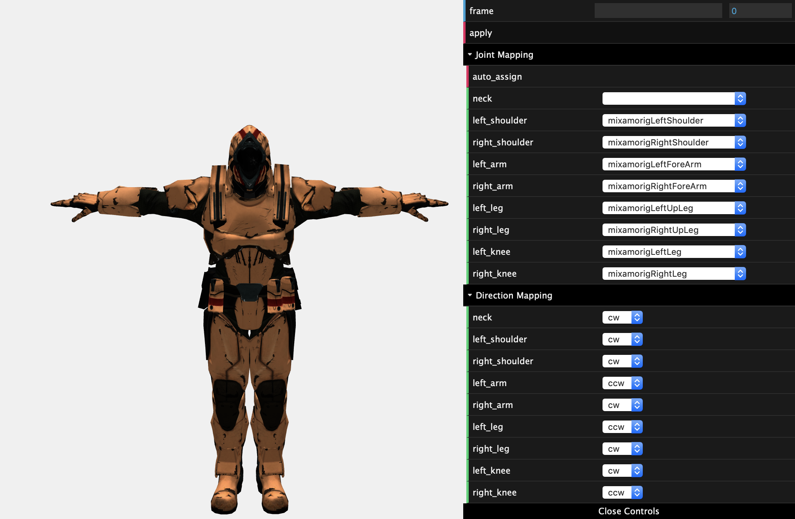

# 15464 Final Project Submission



## 2D Drawing Interface

```
cd interface/
python3 app.py
```

Loads up the kivy drawing interface.


To export rotations to a JSON format, run:
```
cd interface/
python3 joint_parsing.py
```


## 3D Posing Interface

```
cd model/
python3 -m http.server
```

Visit localhost to view the web-browser posing interface.


